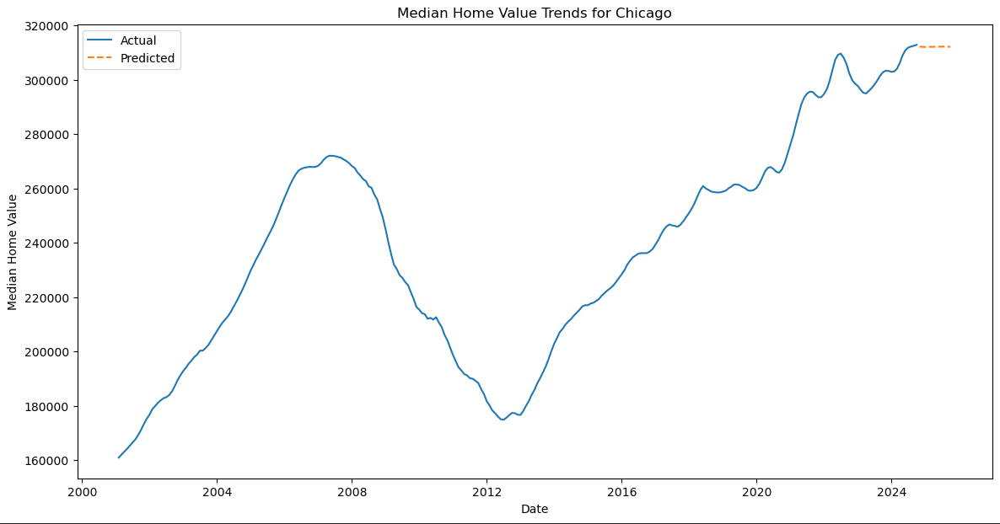

# 🏘️ Chicago Real Estate Investment Predictor

## 🎯 Project Overview

A machine learning-powered analysis of Chicago's real estate market using Zillow Home Value Index (ZHVI) data to predict optimal investment opportunities across different neighborhoods.

## 👥 Authors

- [Umar Khan](https://www.linkedin.com/in/umarkhan394/) 👨‍💻
- Bilal Naseer
- Danny
- Adam
- Abdullah

## 📊 Data Analysis Components

### 🏠 Zillow Home Value Index (ZHVI) Analysis

- Typical home values (35th to 65th percentile range)
- Historical trends from 2000-01 to 2024-09
- Regional market comparisons
- Future value predictions using ML models

### 📈 Key Features

- **Region-based Analysis**: Detailed breakdown of Chicago neighborhoods
- **ML Predictions**: Future home value forecasting
- **Population Trends**: ZIP code demographic analysis
- **Investment Scoring**: Area-specific investment potential calculation

## 🔍 Data Structure

### Zillow Dataset Columns

- RegionID
- SizeRank
- RegionName
- RegionType
- StateName
- State
- City
- Metro
- CountyName
- Monthly ZHVI values (2000-2024)

## 🧮 Machine Learning Analysis

### Model Insights

- **City-wide Predictions**: Stable median home values projected across Chicago
- **East Side Growth**: Significant predicted value increase in East Side neighborhoods
- **Investment Opportunity**: East Side outperforming baseline predictions

### 🔧 Data Processing

1. Data Cleaning Steps:
   - Transposition of ZIP Code data
   - Removal of non-total estimates
   - Column renaming for uniqueness
   - Data type conversions
   - Dataframe consolidation

### 📊 Key Findings

- Correlation between education levels and ZHVI
- Income-property value relationships
- Demographic clustering patterns

## 🛠️ Tech Stack

- Python 3.x
- Jupyter Notebooks
- Pandas & NumPy
- Scikit-learn
- Matplotlib/Seaborn

## 📁 Repository Structure

```
├── Zillow/
│   ├── Chicago_Neighborhoods_Zillow.csv   # Main ZHVI dataset
│   ├── Chicago_ZIP_Populations_*.csv      # Population data
│   ├── Zillow.ipynb                      # Main analysis notebook
│   └── Data/                             # Historical census data
└── Chicago/
    └── Chicago_Neighborhoods.txt         # Neighborhood definitions
```

## 🚀 Getting Started

### Prerequisites

```bash
pip install -r requirements.txt
```

### 📓 Jupyter Notebook

Open `Zillow.html` to view the complete analysis and ML predictions.

## 📈 Visualizations

### Population and Market Analysis


_Analysis of population density distribution across Chicago ZIP codes_

### Regional ZHVI Trends


_Historical ZHVI trends across Chicago neighborhoods_

### East Side Market Analysis


_Predicted home value trends for East Side region_

### Chicago Market Forecast


_Machine learning predictions for Chicago median home values_

## 📝 License

MIT License

## 📮 Contact

For questions about this analysis, please reach out to any of the contributors.
